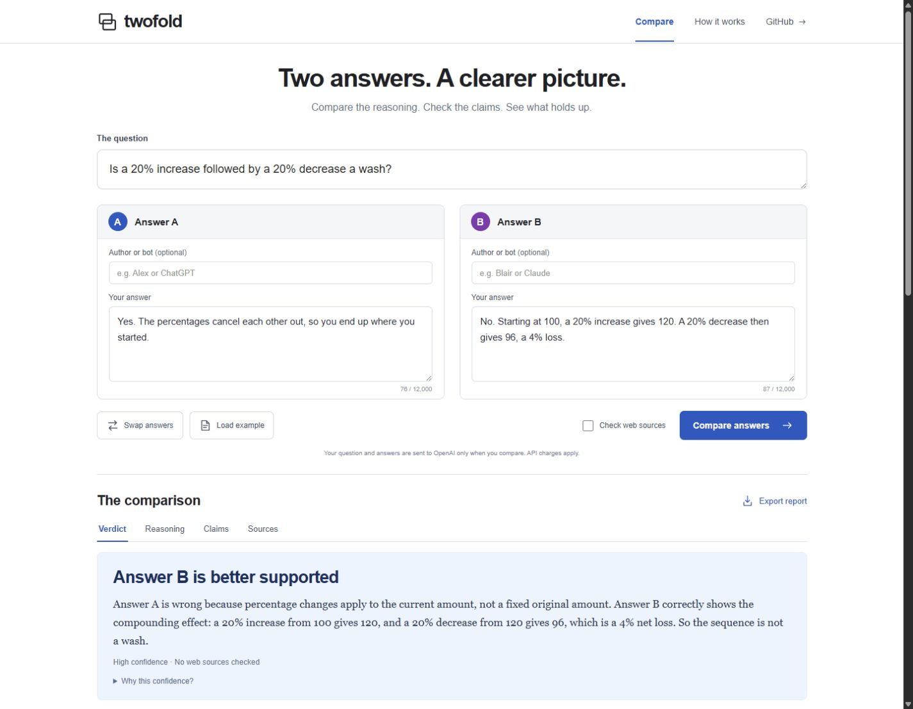

# Twofold

**Compare two answers to the same question.** Examine the reasoning, check disputed claims, and see what the evidence supports.

**[Use Twofold online](https://twofold.alx21.chatgpt.site)** · [Local setup](docs/SETUP.md) · [Developer guide](docs/DEVELOPMENT.md)

## Use the public website

Open [Twofold](https://twofold.alx21.chatgpt.site). No installation, account, or API key is required.

1. Enter the question both answers address.
2. Paste **Answer A** and **Answer B**, including any explanations they give. Author names are optional.
3. Optionally enable **Check web sources** to research factual claims.
4. Select **Compare answers**. A comparison can take up to three minutes.
5. Read the verdict, reasoning, claims, and improved answer. Select **Export report** to download a Markdown copy.

**Load example** fills the form with a percentage question. It does not submit a comparison until you select **Compare answers**.

The public site shares **30 comparisons per day across all visitors**, resetting at midnight UTC. New comparisons must start at least 10 seconds apart. Failed or canceled requests can still use an allowance. If the shared limit is reached, return after the reset or run a local copy with your own key.



## Run your own copy

You need [Node.js 22.12 or newer with npm](https://nodejs.org/en/download), [Git](https://git-scm.com/downloads), and an [OpenAI project API key](https://platform.openai.com/api-keys) with API access and available billing or credits. A ChatGPT subscription does not include API usage.

Run these commands in a terminal:

```sh
git clone https://github.com/agammann/twofold.git
cd twofold
npm ci
npm run setup
npm run build
npm start
```

Setup asks for your key in a hidden terminal prompt and saves it in the ignored `.env.local` file. Do not paste a key into the website, source code, or a GitHub issue.

After the terminal says Twofold is ready, open `http://127.0.0.1:3210` on the same computer. Keep the terminal running; press **Ctrl+C** to stop it. This address is only for your local copy. Share the [public Sites URL](https://twofold.alx21.chatgpt.site) with other people.

For later launches, run `npm start` from the project folder. The [local setup guide](docs/SETUP.md) also covers ZIP downloads, Windows and macOS/Linux launchers, configuration, updating, and troubleshooting. Local comparisons use your own OpenAI account and incur API charges.

## Understand the result

| Verdict | Meaning |
| :--- | :--- |
| Answer A or B | One answer has a substantive supported advantage. |
| Both | Both correctly answer the question under the same supplied conditions. |
| Neither | Evidence establishes that both central answers are false. |
| Depends | Choosing between valid recommendations requires a deciding condition or priority. |
| Insufficient evidence | Missing evidence prevents determining which answer is true. |

The report explains stated reasoning with exact excerpts, labels inferred assumptions, compares strengths and weaknesses, and provides claim assessments and a complete improved answer. Optional web research adds retrieved sources. Sections can be empty when there is nothing justified to report.

Twofold evaluates the explanation supplied; it cannot access a person or bot's private thought process. Model judgments can be wrong. A matching quote, a citation, or high qualitative confidence does not prove correctness. See the [reliability results and known limitations](docs/RELIABILITY.md).

## Privacy

Your question and answers go to OpenAI when you compare. Optional author labels stay in your browser. Web research may send relevant queries to search providers. Exports contain your inputs and results.

The project key stays private on the hosted server; a local copy uses your own server's key. Twofold does not save comparison text or results, and refreshing clears the current report. The public service stores only a shared usage counter and timing information. Hosting and OpenAI retention policies still apply. Read the [privacy and security details](docs/PRIVACY.md).

## Documentation

| Guide | What it covers |
| :--- | :--- |
| [Local setup](docs/SETUP.md) | Install, configure, start, update, and troubleshoot your own copy |
| [Development](docs/DEVELOPMENT.md) | Project layout, commands, tests, and contribution checks |
| [Public hosting](docs/HOSTING.md) | Sites architecture, shared limits, and deployment ownership |
| [Privacy and security](docs/PRIVACY.md) | Data flow, key handling, and protection boundaries |
| [Verification](docs/VERIFICATION.md) | Recorded checks, CI, and historical release evidence |
| [Reliability](docs/RELIABILITY.md) | Live evaluation cases, measured results, and remaining limitations |
| [Example report](docs/example-report.md) | A recorded Markdown export from a live comparison |
| [Design references](docs/DESIGN.md) | Sources behind the interface design |

[GitHub Actions](https://github.com/agammann/twofold/actions/workflows/verify.yml) runs tests, builds, release secret checks, and a production dependency audit on Windows and Ubuntu. Automated checks do not require an API key.

## License

No open source license has been selected for this repository. Contact the repository owner about licensing before redistributing the code.
